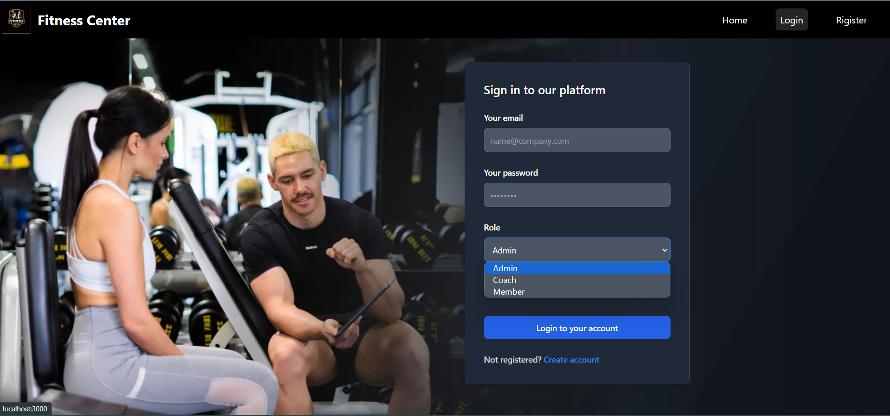
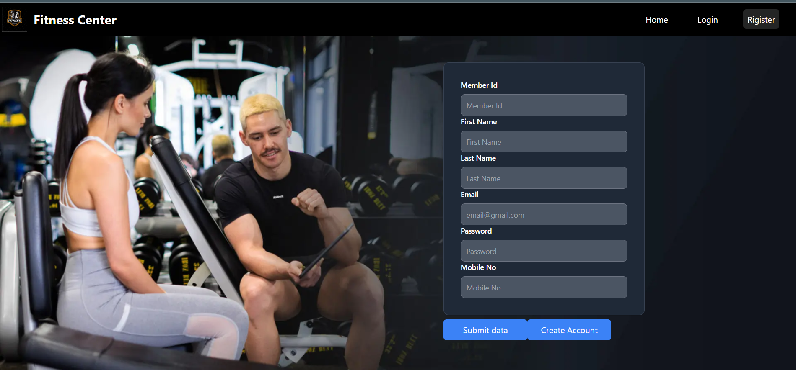

# Gym Management System Web Application 

This project was bootstrapped with [Create React App](https://github.com/facebook/create-react-app).

## 

this is the howe page  of web page there more few section this page 
- About Us
- Popular Packages 
- Coaches 
- Memberships cards 

login page have three options to login 
 - Aa admin
 - As Coach 
- As  Members

New member can create account 

So members and Coaches can login to the their profile and can change their details 

Member can se their exercise  schedule 

Wen login Admin 
admin Can 
- CRUD for operation  packages
- CRUD for operation Exercise 
- CRUD for operation admin
- Edit Member Exercises schedules and payments details 

## Features
Authentication 
 - It use JWT authentication  wen login to the system it create token 

Security 
- All password will decrypt and encrypt  and store in data base using bycript  Library
- All the admin operation have Authenticated  

## Available Scripts

### for font end 
In the project directory, you can run:

### `npm start`

Runs the app in the development mode.\
Open [http://localhost:3000](http://localhost:3000) to view it in your browser.

The page will reload when you make changes.\
You may also see any lint errors in the console.

### `npm test`

Launches the test runner in the interactive watch mode.\
See the section about [running tests](https://facebook.github.io/create-react-app/docs/running-tests) for more information.

### `npm run build`

Builds the app for production to the `build` folder.\
It correctly bundles React in production mode and optimizes the build for the best performance.

The build is minified and the filenames include the hashes.\
Your app is ready to be deployed!

See the section about [deployment](https://facebook.github.io/create-react-app/docs/deployment) for more information.

### for backend 
 
 Run 
 ### `npm start`

 It use 
- Express
- mongoose
- body-parser

